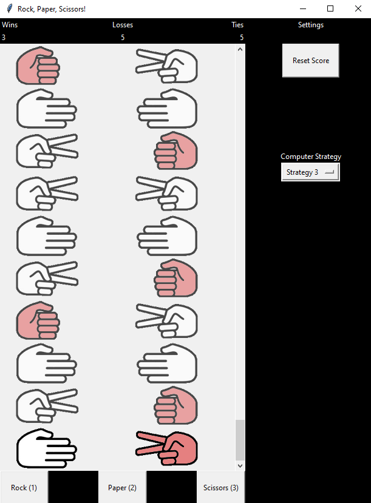

# Machine-Learning Rock Paper Scissors
Python application with a graphical user interface where the player face a bot at Rock Paper Scissors.

**Link to project:**

## How It's Made:

**Tech used:** Python, xgboost, tkinter

The GUI was built using tkinter. The bot that you play against can draw on simple strategies such as markov chains to machine learning-based approaches including decision trees and gradient boosting. The models were trained using data from approximately 250,000 games on roshambo.me.

## Lessons Learned:

This was my first experience creating a program with a graphical user interface. I also leveraged OOP to a greater extent than my previous projects to create the interface. It was also fun to train the machine learning models and apply them to a live game that considers historical inputs rather than as a static predictor.

## Installing:

This repo has not been packaged into a .exe. To install, clone the repository and execute `python rps_gui.py`.

